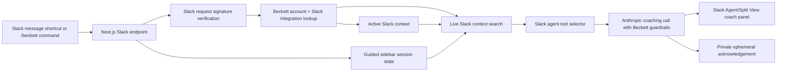

# Beckett for Slack Hackathon Submission Draft

## Track

Primary: Slack Agent for Good  
Backup: New Slack Agent

## One-Line Pitch

Beckett for Slack prepares neurodivergent workers for the conversations that matter at work.

## Description

Beckett for Slack is a private workplace communication coach built for Slack. It helps neurodivergent professionals decode confusing Slack threads, avoid over-reading ambiguous tone, draft replies that match their intent, and prepare for difficult conversations before they happen.

Instead of acting like a generic chatbot or writing assistant, Beckett guides the user through conversation strategy: what is visible, what is uncertain, what the next step should be, and how to say it clearly. Responses are private and ephemeral by default. Beckett can search relevant Slack history when the user asks for coaching, but it does not store full Slack history or raw Slack search results by default.

This hackathon submission is Slack-only. It does not rely on Beckett's Chrome extension, Gmail integration, courses, website dashboard, or beta signup flow.

## Demo Workflow

1. The user sees a vague manager Slack message before a 1:1.
2. The user opens the message shortcut and chooses `Ask Beckett`.
3. Beckett explains what is visible in the thread, what is only a possible interpretation, and what not to over-read.
4. Beckett suggests a next step and 2-3 reply options: Direct but kind, Warm and collaborative, and Concise.
5. The user runs `/beckett prep I need to talk to my manager about workload in my 1:1`.
6. Beckett starts a private sidebar walkthrough instead of opening a modal.
7. Beckett asks one focused setup question at a time.
8. Beckett searches relevant Slack history for possible evidence instead of making the user remember and paste everything manually.
9. Beckett asks the user to confirm what evidence to include, then builds talking points, an opening line, likely pushback, a practice prompt, and a follow-up draft.

## Demo Workspace Threads

### Vague Manager Task Handoff

Priya: Can you clean up the onboarding flow before Friday?  
Priya: Nothing huge, just make it easier for the review.

User asks Beckett: What does she actually want from me here?

### Passive-Aggressive Teammate Thread

Morgan: I guess I can take another pass at the deck if that helps.  
Morgan: I just thought we were already aligned on the direction.

User asks Beckett: Is Morgan annoyed or am I overthinking this?

### Boundary/Workload 1:1

Nick: Can you also take on the vendor follow-up this week?  
Nick: I know you have a lot, but it should be quick.

User asks Beckett: Help me prep for my 1:1. I need to say I cannot take this on without sounding difficult.

### Feedback Response

Claire: The client email was clear, but next time I need you to flag risk earlier.  
Claire: We were too close to the deadline to adjust.

User asks Beckett: Help me respond without sounding defensive.

## Architecture Diagram

## Privacy Notes

- Beckett responds privately by default.
- Beckett does not post into the channel unless the user chooses to copy or send wording.
- Beckett does not store full Slack history or raw Slack search results by default.
- Beckett separates visible evidence from possible interpretation.
- Beckett does not infer diagnosis or hidden intent.
- Guided sidebar questions collect only the context Beckett needs for the requested coaching session.

## Demo Script

Opening: "Beckett for Slack is a neurodivergent workplace communication coach. It helps people prepare for high-stakes conversations, understand ambiguous tone, and respond clearly without over-apologizing or spiraling."

Demo:
1. Show the vague manager thread.
2. Click `Ask Beckett`.
3. Highlight that Beckett names visible evidence and uncertainty separately.
4. Show reply options.
5. Run `/beckett prep I need to talk to my manager about workload in my 1:1`.
6. Show Beckett starting the prep in the Slack Agent/Split View panel.
7. Show Beckett asking one focused question at a time.
8. Show Beckett pulling possible evidence from relevant Slack history.
9. Show the user confirming what to include.
10. Show talking points, opening line, likely pushback, practice prompt, and follow-up draft.

Close: "Beckett for Slack helps neurodivergent workers communicate clearly inside the tool where work already happens."

## Slack-Only Test Checklist

- `/beckett` returns a clean help card with no timeout.
- `/beckett decode "Sure, sounds fine."` routes coaching into Beckett's Slack assistant conversation without opening a modal.
- `/beckett respond`, `/beckett rewrite`, `/beckett decode`, `/beckett prep`, and `/beckett practice` are the only visible slash subcommands.
- `/beckett draft`, `/beckett clarity`, `/beckett boundary`, `/beckett followup`, and `/beckett tone` return a clean unsupported/help response.
- `Ask Beckett` message shortcut returns a private response that separates visible facts from possible interpretation.
- `/beckett prep I need to ask my manager for a raise` starts a private guided sidebar flow without opening a modal.
- Prep output appears privately in Slack.
- Sidebar assistant flow asks focused follow-up questions instead of producing only one long wall of text when more context is needed.
- Beckett searches authorized Slack history for possible evidence before asking the user to provide evidence manually.
- Beckett asks the user to confirm what evidence to include.
- Beckett does not hallucinate reactions, agreement, annoyance, rapport, or hidden intent.
- Beckett does not post publicly by default.
- Demo excludes Chrome extension, Gmail, courses, website dashboard, and beta signup.
